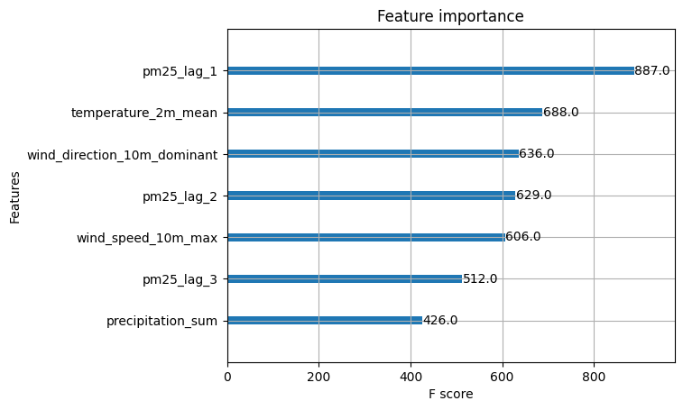
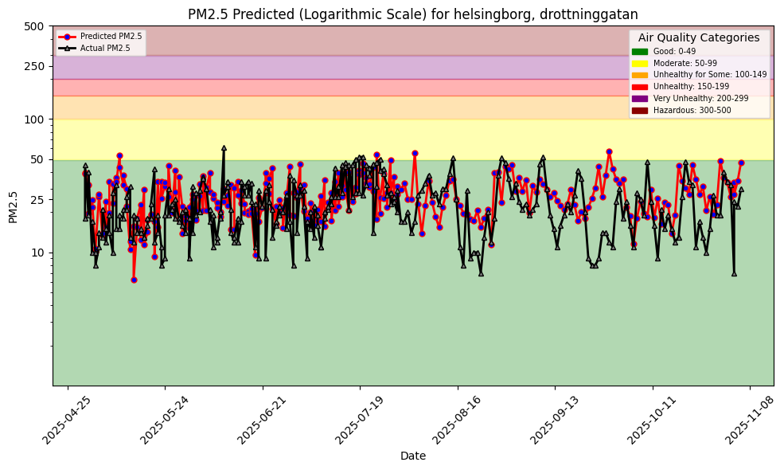
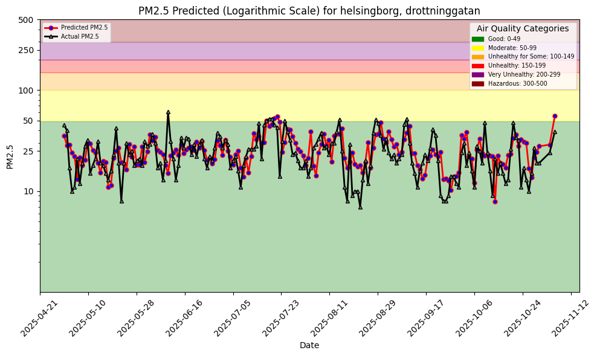
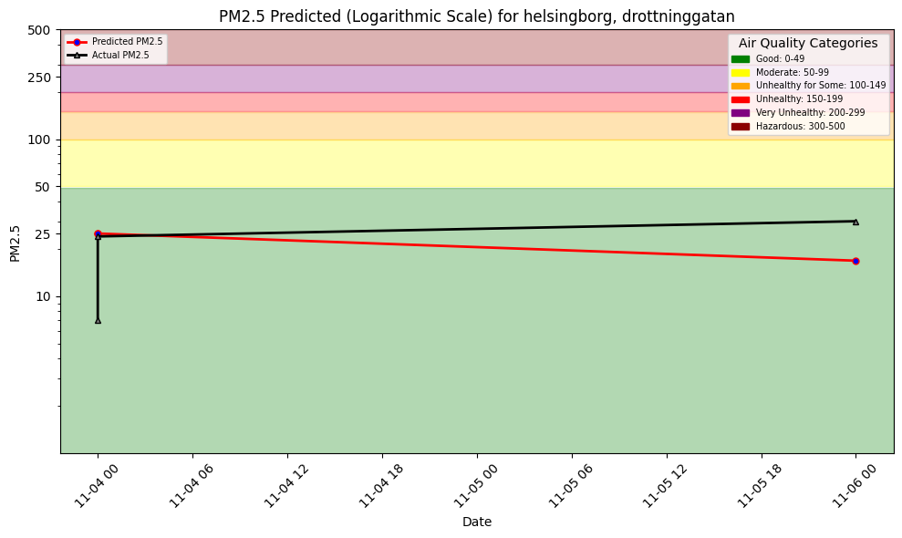
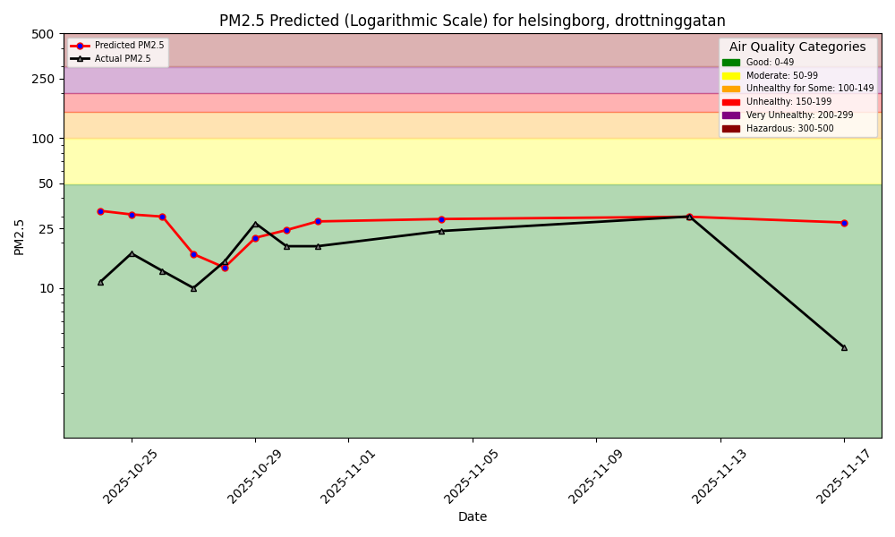

# ID2223 Lab1
Chih-Yun Liu (cyliu4@kth.se)  
Hanaé Ben Makhlouf (hanaebm@kth.se)

---

## Project Overview

This project implements a machine learning pipeline for air quality prediction, specifically focusing on PM2.5 (particulate matter) forecasting. The system is designed to handle multiple sensors simultaneously, enabling monitoring across different locations in the Helsingborg and Landskrona area in Sweden.

### Key Features
- **Multi-sensor support**: Handles data from three distinct air quality monitoring stations
- **Temporal features**: Incorporates lag features (1, 2, and 3-day historical data) for improved prediction accuracy
- **Automated pipeline**: Uses GitHub Actions for continuous model training and inference
- **Feature engineering**: Leverages Hopsworks for feature store management
- **Model versioning**: Independent models for each sensor location

---

## How to Run

The project uses a Makefile for simplified execution. Each sensor has a unique ID:
- **ID 1**: Drottninggatan
- **ID 2**: Ramshogsvagen  
- **ID 3**: Larod

### Commands

```bash
# Generate features for a specific sensor
make aq-features id=x

# Train the model for a specific sensor
make aq-train id=x

# Generate predictions for a specific sensor
make aq-reference id=x
```

Replace `x` with 1, 2, or 3 depending on which sensor you want to work with.

### Example
```bash
# Complete pipeline for Drottninggatan (sensor 1)
make aq-features id=1
make aq-train id=1
make aq-reference id=1
```

---

## Implementation Details

### 1. Add New Feature (Grade C)

**What we added:**

We selected lag_1, lag_2, and lag_3 as new features, which means the pm25 data from 1 day, 2 days, and 3 days before, into the model. And these new feature help significantly on the accuracy. First, the importance of lag features is high for the model (See Figure 1). Also, as we can see in the comparison plot with and without lag features, the plot with lag features align more to the ground truth in both training and inferencing (See Figure 2 and 3).

**Results:**



**Without New Features (Training)**



**With New Features (Training)**



**Without New Features (Inference)**



**With New Features (Inference)**



---

### 2. Multi-Sensors (Grade A)

For the notebooks to run multi-sensors, we do the following modifications.

**1. Select Sensors**

Our designated area is "Helsingborg and Landskrona", and the 3 sensors we chose are Drottinggatan, Ramshogsvagen, Larod.

**2. .env**

We give each sensors an id, and put all the information including url, country, city, street, and csv file path onto .env file with the name always ends with "_id".

**3. Notebook**

We modify the notebooks for to take sensor id as input through command line. First, we parse the input from the command line and got the attribute "id". Then, we get the station information through .env, with name ends with "_id". And the rest process are remain the same, but the feature group's name, feature view's name, and model name are also ends with "_id" so that each of the sensors can have independent training feature and model, thus provide independent prediction result.

**4. Make File**

We modify the make file for us to run the notebook by command line and take id as input. We add "-- --id 1" at the end of the previous command, which means pass value 1 as argument id to the notebook.

**5. .yml file**

In section: execute python workflows from bash script, instead of running only "make aq-inference", we modify the command to "make aq-inference id=1 make aq-inference id=2 make aq-inference id=3", so that it can run 3 sensors each time we start a github action.

---

## Architecture Overview

```
┌─────────────────────────────────────────────────────────────┐
│                     GitHub Actions                           │
│                  (Scheduled Workflow)                        │
└────────────────────┬────────────────────────────────────────┘
                     │
                     ▼
        ┌────────────────────────────┐
        │    For each sensor (1-3)   │
        └────────────┬───────────────┘
                     │
         ┌───────────┼───────────┐
         │           │           │
         ▼           ▼           ▼
    ┌────────┐  ┌────────┐  ┌────────┐
    │ Sensor │  │ Sensor │  │ Sensor │
    │   1    │  │   2    │  │   3    │
    └────┬───┘  └────┬───┘  └────┬───┘
         │           │           │
         ▼           ▼           ▼
    ┌──────────────────────────────┐
    │   Feature Engineering        │
    │   (Add lag features)         │
    └────────┬─────────────────────┘
             │
             ▼
    ┌──────────────────────────────┐
    │   Hopsworks Feature Store    │
    │   - air_quality_fg_1         │
    │   - air_quality_fg_2         │
    │   - air_quality_fg_3         │
    └────────┬─────────────────────┘
             │
             ▼
    ┌──────────────────────────────┐
    │   Model Training             │
    │   (XGBoost per sensor)       │
    └────────┬─────────────────────┘
             │
             ▼
    ┌──────────────────────────────┐
    │   Model Registry             │
    │   - model_1                  │
    │   - model_2                  │
    │   - model_3                  │
    └────────┬─────────────────────┘
             │
             ▼
    ┌──────────────────────────────┐
    │   Batch Inference            │
    │   (Generate predictions)     │
    └────────┬─────────────────────┘
             │
             ▼
    ┌──────────────────────────────┐
    │   Visualization Dashboard    │
    │   (Per-sensor predictions)   │
    └──────────────────────────────┘
```

---

## Technical Stack

- **Python**: Core programming language
- **Poetry**: Dependency management
- **Jupyter Notebooks**: Interactive development and execution
- **XGBoost**: Machine learning model
- **Hopsworks**: Feature store and model registry
- **GitHub Actions**: CI/CD automation
- **dotenv**: Environment variable management

---

## Project Structure

```
.
├── notebooks/
│   ├── 1_air_quality_feature_backfill.ipynb
│   ├── 2_air_quality_training_pipeline.ipynb
│   └── 3_air_quality_batch_inference.ipynb
├── img/
│   ├── feature_2.png
│   ├── p3.png
│   ├── p3_2.png
│   └── cmp.png
├── docs/
│   └── air-quality/
│       └── assets/
│           └── img/
│               └── pm25_hindcast_1day_1.png
├── .github/
│   └── workflows/
│       └── features_and_predictions.yml
├── .env
├── Makefile
├── pyproject.toml
└── README.md
```

---

## Results and Impact

The implementation successfully demonstrates:

1. **Improved Accuracy**: Lag features provide significant improvement in prediction accuracy, with predictions closely tracking ground truth values in both training and inference phases.

2. **Scalability**: The multi-sensor architecture can easily be extended to monitor additional locations by simply:
   - Adding new entries to `.env`
   - Running the pipeline with a new sensor ID

3. **Automation**: Fully automated daily updates ensure predictions are always current without manual intervention.

4. **Maintainability**: Clean separation of concerns (configuration, data, models) makes the system easy to maintain and debug.

---

## Future Improvements

Potential enhancements to consider:

- **Additional features**: Weather data (temperature, humidity, wind speed), traffic patterns, seasonal indicators
- **Advanced models**: Deep learning models (LSTM, GRU) for better temporal pattern recognition
- **Real-time inference**: Transition from batch to streaming predictions
- **Alerting system**: Notifications when predicted PM2.5 exceeds health thresholds
- **Web dashboard**: Interactive visualization of predictions across all sensors
- **Model monitoring**: Automated performance tracking and retraining triggers
- **Feature store optimization**: Implement feature versioning and time-travel capabilities
- **Cross-sensor analysis**: Analyze spatial correlations between nearby sensors

---

## Installation

### Prerequisites
- Python 3.8+
- Poetry
- Hopsworks account
- GitHub account (for Actions)

### Setup

1. Clone the repository:
```bash
git clone <repository-url>
cd id2223-lab1
```

2. Install dependencies:
```bash
poetry install
```

3. Configure environment variables:
```bash
cp .env.example .env
# Edit .env with your sensor configurations and API keys
```

4. Set up Hopsworks credentials:
- Create a Hopsworks project
- Add your API key to `.env`

5. Run the pipeline:
```bash
make aq-features id=1
make aq-train id=1
make aq-reference id=1
```

---

## Contributing

We welcome contributions! Please follow these guidelines:

1. Fork the repository
2. Create a feature branch (`git checkout -b feature/amazing-feature`)
3. Commit your changes (`git commit -m 'Add amazing feature'`)
4. Push to the branch (`git push origin feature/amazing-feature`)
5. Open a Pull Request

---

## Conclusion

This project successfully implements a robust, scalable air quality prediction system that can simultaneously monitor multiple locations. The addition of temporal lag features significantly improves prediction accuracy, while the multi-sensor architecture provides a solid foundation for expansion to additional monitoring locations. The automated pipeline ensures continuous monitoring and up-to-date predictions, making it a practical solution for real-world air quality monitoring applications.
